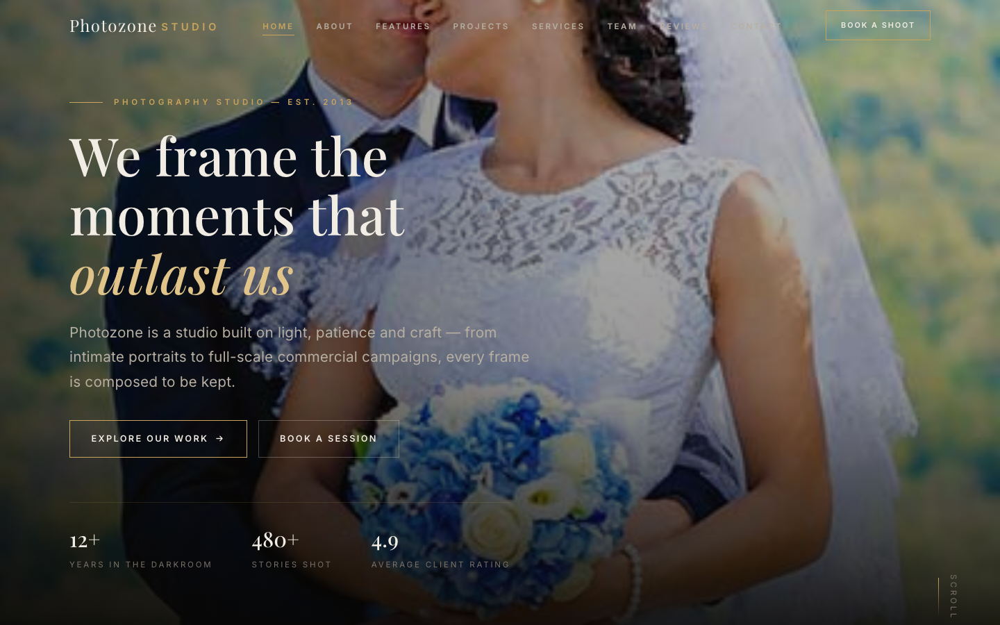

# Photozone — Professional Photography Studio

A premium, fully responsive HTML template for a professional photography studio. The design evokes a warm darkroom aesthetic — near-black grounds, amber "safelight" highlights, and generous typography — to position the studio as a place of craft, patience, and considered light.

## 📸 Screenshot

## Design System

| Token | Value |
|-------|-------|
| **Primary palette** | `--c-bg` `#070605`, `--c-accent` `#c8a45c`, `--c-text` `#f2ede4` |
| **Accent** | `--c-accent-soft` `#e0c48a`, `--c-accent-deep` `#9a7a3a` |
| **Neutrals** | `--c-bg-alt` `#0d0b0a`, `--c-bg-card` `#141210`, `--c-text-soft` `#b8afa3`, `--c-text-dim` `#7a726a` |
| **Display type** | `Playfair Display` (serif, 400–600, italic) |
| **Body type** | `Inter` (sans, 400–600) |
| **Container** | 1200px max-width, centered |
| **Breakpoints** | ~980px (tablet), ~720px (mobile) |

## Pages

| Page | File | Description |
|------|------|-------------|
| Home | [index.html](index.html) | Hero crossfade, about preview, featured projects, services, testimonials, CTA |
| About | [about.html](about.html) | Studio story, values, stats, team preview |
| Features | [feature.html](feature.html) | Studio features, gear, process, workflow |
| Projects | [project.html](project.html) | Portfolio grid, case studies, featured work |
| Services | [service.html](service.html) | Service offerings, session types, pricing info |
| Team | [team.html](team.html) | Photographer grid, how we work, stats |
| Reviews | [testimonial.html](testimonial.html) | Client testimonials, ratings, stats |
| Contact | [contact.html](contact.html) | Studio info, contact form with `[data-form]` validation, location |
| 404 | [404.html](404.html) | On-brand error page with studio navigation |

## Features

- **Framework-free** — pure HTML5, CSS3 (custom properties, Grid, Flexbox, `clamp()`), vanilla JavaScript
- **Darkroom aesthetic** — warm near-black palette with amber accent, grain overlays, film-era typography
- **Fluid responsive** — 3 breakpoints, no horizontal scroll on any viewport
- **Scroll reveal** — IntersectionObserver-powered `.reveal` animations (respects `prefers-reduced-motion`)
- **Mobile nav** — burger toggle with `aria-expanded` accessible pattern
- **Hero crossfade** — automatic 6s image transition via `.hero-bg img` + `.active` class
- **Form validation** — `[data-form]` hook with `.form-ok` / `.form-err` / `.show` toggle
- **Glyph icons** — custom inline SVG icons in markup, no icon library dependency
- **Original imagery** — all photographs are production-quality studio images, no placeholders

## Tech Stack

- HTML5 + CSS3 (W3C-valid, semantic landmarks)
- Vanilla JavaScript (76-line IIFE, unmodified canonical build)
- Google Fonts (Playfair Display + Inter)
- SVG favicon (inline data: URI)

## SEO

- Semantic HTML5 structure (`<header>`, `<nav>`, `<main>`, `<section>`, `<footer>`)
- Unique `<title>` and `<meta description>` per page
- `lang="en"` attribute, `charset="utf-8"`, viewport meta
- Alt text on all images
- Open Graph / Twitter Card meta tags on every page

## License

Free for personal and commercial use. Attribution appreciated but not required.

---

## Let's Build Something Together 🚀

[Book a free consultation](https://tally.so/r/q4q1L9)